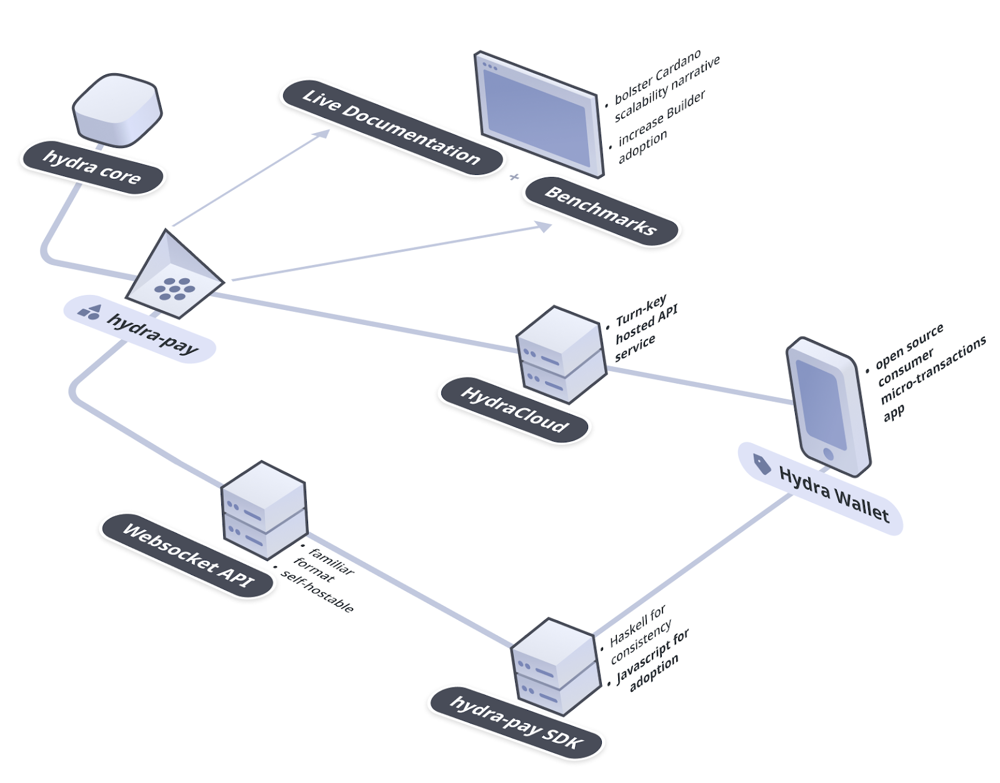

# Hydra for Auctions

> Using Hydra for Peer-To-Peer Payments

:::tip [This section is a stub and will be updated soon to include several use cases for Hydra in the payments domain]
:::

### Introduction
Hydra for Payments is an ongoing collaboration between Input Output Global (IOG) and Obsidian Systems meant to complement the evolving Hydra Head protocol with tooling designed for payment-specific use cases. The post introducing this project can be found [here](https://iohk.io/en/blog/posts/2022/11/10/hydra-for-payments-introducing-developer-tooling-to-unlock-micropayments-on-cardano/).

The current phase of development is focused on extending the existing open-source Hydra for Payments library by providing the following:

- An expanded payment channel API with convenience features meant to reduce builder ramp-up and time-to-market for their projects.

- High-assurance mechanisms especially important for builders of commercial projects trusted with user assets.

- Flexible configurations with sensible defaults to help builders dynamically scale their product and implement compelling user experiences.

The plan is to consolidate this work and make it available as the mainnet-compatible Hydra for Payments SDK.

To validate these aims, the launch of a mobile reference application will follow. The application will directly utilize the Hydra for Payments SDK for all of critical payment channel functionality.

Hydra for Payments is under active development and can be found [here](https://github.com/obsidiansystems/hydra-pay).

### Example Configuration

:::warning Keep an eye on this section

More to follow soon, including use cases for Hydra for Payments...

:::